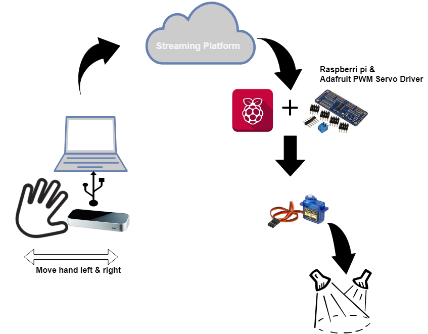
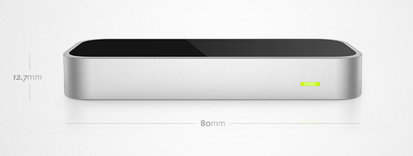

### **_Members_**
- [Alan Heanue](https://github.com/heanuea)
- [Garret Tonra](https://github.com/gtonra89)

## **_Brief_**
Develop an application with a Natural User Interface. You have a choice of technologies available to you and an opportunity 
to combine a lot of technology that you have worked with over the past four years.

## **_Research and Concepts_**
So we had a lot of choice in this project and a lot of freedom we had to work in pairs so we both had Rasberry pis but wernet to sure to do with them. 
The college had a range of tech that we could have used for example they had [Kinect](https://en.wikipedia.org/wiki/Kinect) , [Myo Armband](https://www.myo.com/) , [Leap motiom](https://www.leapmotion.com/) 
and also we did in lab tutorials in how to work with [Cortona](https://en.wikipedia.org/wiki/Cortana). But we wanted something where we can use the rasberry pi or even an adruino as students we didnt want to invest to much in buying much gear for that like a camera or screen for the pi, we decided to use the Leap motion.

**concept one**
- Was to use leap motion with the rasberry pi work between them was going to a stream and than an adruino to connect with 2 servos 
[]

**concept Two**
- We decided to drop the Rasberri pi as there was a lot of work with the stream to connect time was not our side so we decided to for a leap to adruino with a breadboard circuit with LED lights attached. 

[]

## **_OverView Of the Project_**
The Project involves the leap motion and connecting it with the Arduino Using Node Js Librarys Running a few commands this will lead to hand gestures from the lep motion 
and sending a signal to a circuit board with led lights that change color with the different gestures. 
There is a video demo of the project below. 
 

## **_Technology we are using_**
Here is some of technologys we are using You will need to download the Following.

### **_Motion Leap_**
The Leap Motion controller is a small USB peripheral device which is designed to be placed on a physical desktop, facing upward. It can also be mounted onto a virtual reality headset. Using two monochromatic IR cameras and three infrared LEDs, the device observes a roughly hemispherical area, to a distance of about 1 meter. The LEDs generate pattern-less IR light[25] and the cameras generate almost 200 frames per second of reflected data.[26] This is then sent through a USB cable to the host computer, where it is analyzed by the Leap Motion software using "complex maths" in a way that has not been disclosed by the company, in some way synthesizing 3D position data by comparing the 2D frames generated by the two cameras.In a 2013 study, the overall average accuracy of the controller was shown to be 0.7 millimeters.
[]

The smaller observation area and higher resolution of the device differentiates the product from the Kinect, which is more suitable for whole-body tracking in a space the size of a living room. In a demonstration to CNET, the controller was shown to perform tasks such as navigating a website, using pinch-to-zoom gestures on maps, high-precision drawing, and manipulating complex 3D data visualizations.

Leap Motion initially distributed thousands of units to developers who are interested in creating applications for the device. The Leap Motion controller was first shipped in July 2013.In February 2016, Leap Motion released a major beta update to its core software. Dubbed Orion, the software is designed for hand tracking in virtual reality.
### **_Rasberry pi_**
### **_Adafruit 16-Channel 12-bit PWM/Servo Driver_**

## **_How To Run_**
1. Install [nodejs](http://www.nodejs.org/)
2. Run ``npm install``
3. Install [cylonjs](https://cylonjs.com), a robotics javascript framework.
4. Install Leap motion SDK
5. With NPM Install download the Following ``Cylon, cylon-firmata, and cylon-leapmotion.``

## **_Code_**
## **_Presentation_**
## **_References_**
- http://blog.leapmotion.com/hardware-to-software-how-does-the-leap-motion-controller-work/
- https://en.wikipedia.org/wiki/Leap_Motion
- 
## **__**